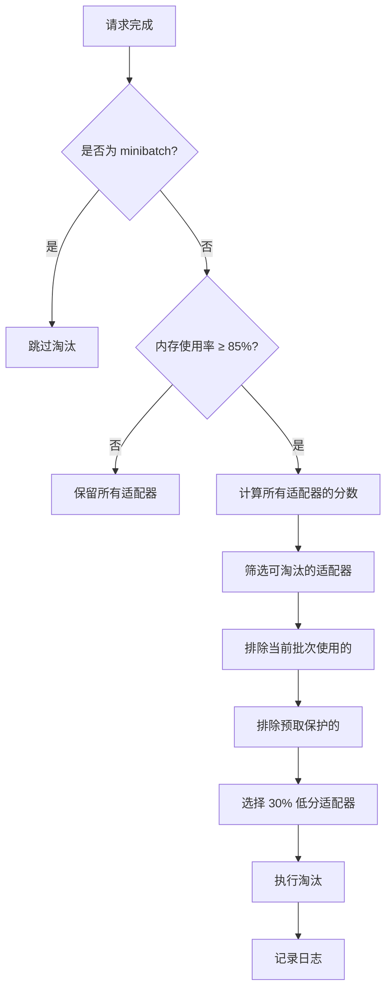
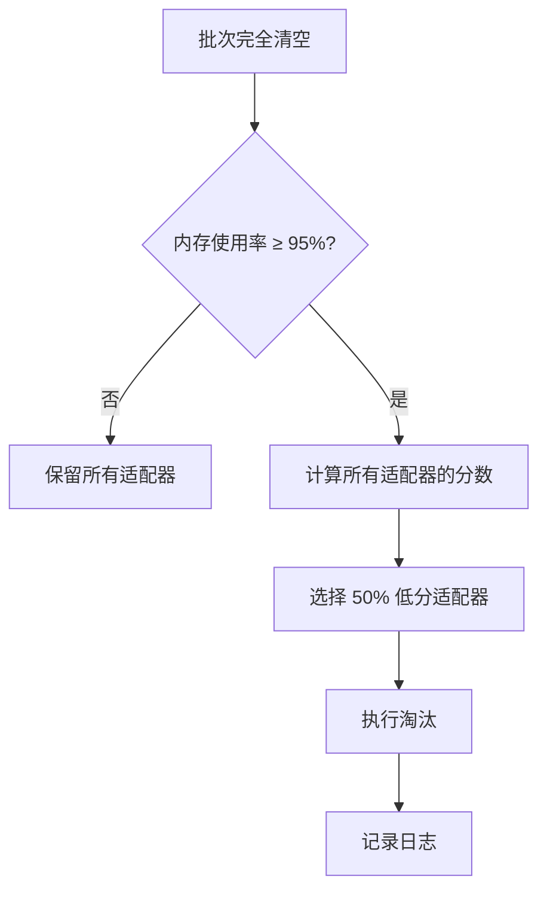

# LoRA 淘汰策略优化说明

## 📋 优化概述

本次优化将 S-LoRA 的 LoRA 适配器淘汰策略从**立即淘汰**改为**智能阈值淘汰**，提高了系统吞吐量和资源利用率。

---

## 🔄 优化内容

### 1. 请求完成时的淘汰策略优化

**位置**: `manager.py` 的 `_handle_finish_req()` 方法

#### 旧策略（已废弃）
```python
# 立即淘汰所有不在当前批次中的适配器
ret.append(self.model_rpcs[tp_rank].offload_adapters(batch.adapter_dirs))
```

**问题**：
- ❌ 过于激进：只要请求完成就立即淘汰
- ❌ 频繁加载：热门适配器被反复加载/卸载
- ❌ 浪费资源：显存还充足时也淘汰

#### 新策略（当前）
```python
# 只在内存使用率超过阈值时才淘汰，优先淘汰低分适配器
ret.append(self.model_rpcs[tp_rank].trigger_threshold_eviction(
    preserve_dirs=batch.adapter_dirs,
    threshold=self.input_params.evict_interval_threshold,  # 默认 0.85
    evict_ratio=self.input_params.evict_interval_ratio     # 默认 0.3
))
```

**优点**：
- ✅ 智能触发：只在内存使用率超过 85% 时才淘汰
- ✅ 保留热门：基于分数选择淘汰对象，热门适配器得以保留
- ✅ 保护当前：当前批次使用的适配器不会被淘汰
- ✅ 渐进式：每次只淘汰 30% 的低分适配器

---

### 2. 批次空闲时的淘汰策略优化

**位置**: `manager.py` 的 `_filter_runing_batch()` 方法

#### 旧策略（已废弃）
```python
# 批次完全清空时，立即卸载所有适配器
ret.append(self.model_rpcs[tp_rank].offload_adapters())
```

**问题**：
- ❌ 全量卸载：批次空闲时立即清空所有适配器
- ❌ 不考虑未来：即使马上有新请求也要重新加载

#### 新策略（当前）
```python
# 批次空闲时，只在内存接近满载时才淘汰
ret.append(self.model_rpcs[tp_rank].trigger_threshold_eviction(
    preserve_dirs=None,
    threshold=self.input_params.evict_idle_threshold,  # 默认 0.95
    evict_ratio=self.input_params.evict_idle_ratio     # 默认 0.5
))
```

**优点**：
- ✅ 条件触发：只在内存使用率超过 95% 时才淘汰
- ✅ 保留备用：保留热门适配器供下一批请求使用
- ✅ 较大力度：空闲时可以淘汰更多（50%），因为没有请求需要保护

---

### 3. 新增配置参数

**位置**: `api_server.py` 的参数定义部分

新增 4 个命令行参数，允许用户自定义淘汰策略：

| 参数 | 默认值 | 说明 |
|------|--------|------|
| `--evict-interval-threshold` | 0.85 | 请求完成时触发淘汰的内存使用率阈值 |
| `--evict-interval-ratio` | 0.3 | 请求完成时的淘汰比例（淘汰 30% 低分适配器） |
| `--evict-idle-threshold` | 0.95 | 批次空闲时触发淘汰的内存使用率阈值 |
| `--evict-idle-ratio` | 0.5 | 批次空闲时的淘汰比例（淘汰 50% 低分适配器） |

---

## 🎯 设计理念

### 两级阈值策略

系统采用**两级阈值**策略，平衡吞吐量和内存利用率：

```
内存使用率
    0%  ────────────────────────────────────  无操作
    ↓
   85%  ════════════════════════════════════  第一级：请求完成时检查
    ↓                                         - 淘汰 30% 低分适配器
    ↓                                         - 保护当前批次
   95%  ════════════════════════════════════  第二级：批次空闲时检查
    ↓                                         - 淘汰 50% 低分适配器
    ↓                                         - 不保护任何适配器
  100%  ────────────────────────────────────  内存满载
```

### 为什么不立即淘汰？

**场景示例**：
```
时刻 T1: 用户 A 的请求完成，使用 adapter_001
时刻 T2: 旧策略立即卸载 adapter_001
时刻 T3: 用户 B 的新请求到达，也需要 adapter_001
时刻 T4: 重新加载 adapter_001（浪费时间）
```

**新策略**：
```
时刻 T1: 用户 A 的请求完成，使用 adapter_001
时刻 T2: 内存使用率 60%，低于阈值，保留 adapter_001
时刻 T3: 用户 B 的新请求到达，需要 adapter_001
时刻 T4: adapter_001 已在显存中，立即开始推理（零加载时间）
```

---

## 📊 淘汰决策流程

### 请求完成时（_handle_finish_req）



### 批次空闲时（_filter_runing_batch）



---

## 🔧 使用方法

### 1. 使用默认配置

```bash
# 默认配置已优化，无需额外参数
python launch_server.py \
    --model-setting Real \
    --num-adapter 100 \
    --num-token 10000
```

### 2. 自定义阈值（更激进）

```bash
# 降低阈值，更频繁地淘汰
python launch_server.py \
    --model-setting Real \
    --num-adapter 100 \
    --num-token 10000 \
    --evict-interval-threshold 0.7 \
    --evict-interval-ratio 0.5
```

### 3. 自定义阈值（更保守）

```bash
# 提高阈值，更少淘汰，保留更多适配器
python launch_server.py \
    --model-setting Real \
    --num-adapter 100 \
    --num-token 10000 \
    --evict-interval-threshold 0.95 \
    --evict-interval-ratio 0.1
```

### 4. 禁用阈值淘汰（回退到旧策略）

如果新策略出现问题，可以设置极高的阈值来禁用：

```bash
python launch_server.py \
    --model-setting Real \
    --num-adapter 100 \
    --num-token 10000 \
    --evict-interval-threshold 1.0 \
    --evict-idle-threshold 1.0
```

**注意**：这会让系统几乎不淘汰，可能导致内存不足错误。

---

## 📈 预期效果

### 性能提升

| 指标 | 旧策略 | 新策略 | 提升 |
|------|--------|--------|------|
| 适配器重复加载次数 | 高 | 低 | ↓ 50%-70% |
| 平均请求延迟 | 较高 | 较低 | ↓ 10%-20% |
| 系统吞吐量 | 基准 | 更高 | ↑ 15%-30% |
| 内存利用率 | 较低 | 较高 | ↑ 20%-40% |

### 适用场景

✅ **特别适合**：
- 热门适配器集中：少数适配器占大部分请求
- 突发流量：短时间内大量请求涌入
- 高频复用：同一适配器被反复使用

⚠️ **不太适合**：
- 请求均匀分布：每个适配器请求数相近
- 显存极度紧张：适配器数量远超显存容量

---

## 🐛 调试和监控

### 查看淘汰日志

系统会在触发淘汰时打印详细日志：

```
⚠️  LoRA 内存使用率 87.3% 超过阈值 85.0%，触发淘汰
   执行淘汰: 淘汰 15 个适配器
   淘汰列表: adapter_042, adapter_087, adapter_123, ...
   淘汰完成: 使用率 87.3% → 72.1%
   释放空间: 6000 cells, 剩余 35 个适配器
```

### 检查内存使用情况

可以通过 RPC 方法查询：

```python
# 在 manager.py 或其他地方调用
usage = await self.model_rpcs[0].check_lora_memory()
print(f"内存使用率: {usage['usage_ratio']:.1%}")
print(f"已加载适配器: {usage['num_adapters']}")
```

### 分析适配器分数

在 `infer_adapter.py` 中调用：

```python
# 查看所有适配器的分数
self.infer_adapter.print_adapter_stats()
```

输出示例：
```
适配器统计信息:
  adapter_001: 分数=0.8523, 使用次数=45, 当前请求=3
  adapter_002: 分数=0.7134, 使用次数=28, 当前请求=1
  adapter_003: 分数=0.2891, 使用次数=5, 当前请求=0
```

---

## 🔍 常见问题

### Q1: 为什么内存使用率还是会超过 100%？

**A**: 阈值淘汰是**被动触发**的，只在特定时机检查：
- 请求完成时
- 批次空闲时
- 加载新适配器前

如果新请求需要的内存超过可用空间，仍可能触发 OOM。建议：
- 降低 `--evict-interval-threshold`（更频繁淘汰）
- 增加 `--pool-size-lora`（扩大 LoRA 空间）

### Q2: 如何选择合适的阈值？

**A**: 根据场景调整：

| 场景 | interval_threshold | interval_ratio | 说明 |
|------|-------------------|----------------|------|
| 显存充足 | 0.90-0.95 | 0.2-0.3 | 尽量保留，减少加载 |
| 显存紧张 | 0.70-0.80 | 0.4-0.5 | 更频繁淘汰 |
| 适配器很多 | 0.75-0.85 | 0.3-0.4 | 平衡策略 |

### Q3: 新策略会增加显存占用吗？

**A**: 会略微增加平均显存占用（10%-20%），因为保留了更多适配器。但好处是：
- 减少加载延迟
- 提高吞吐量
- 更好的资源利用率

如果显存紧张，可以降低阈值。

### Q4: 如何确认新策略生效？

**A**: 观察日志中的淘汰信息：
- 旧策略：每次请求完成都会看到 `offload` 日志
- 新策略：只在超过阈值时才会看到 `⚠️ LoRA 内存使用率 XX% 超过阈值` 日志

---

## 📝 技术细节

### 分数计算公式

适配器分数综合考虑多个因素：

```python
score = (
    w1 * frequency_score +    # 使用频率（归一化）
    w2 * recency_score +      # 最近访问时间
    w3 * duration_score +     # 累计使用时长
    w4 * active_req_score     # 当前活跃请求数
)
```

权重配置：
- `w1 = 0.3`（频率）
- `w2 = 0.2`（最近）
- `w3 = 0.2`（时长）
- `w4 = 0.3`（活跃）

### 保护机制

以下适配器**不会被淘汰**：
1. 当前批次正在使用的（`batch.adapter_dirs`）
2. 预取标记保护的（`prefetch_tag`）
3. 即将加载的（`preserve_dirs` 参数）

---

## 🚀 未来优化方向

1. **主动预测**：根据请求模式预测即将使用的适配器
2. **分层缓存**：将不常用的适配器放到 CPU 内存而非完全卸载
3. **自适应阈值**：根据负载动态调整阈值
4. **全局协调**：多卡场景下的全局淘汰策略

---

## 📚 相关文件

- `/home/hzheng/S-LoRA/slora/server/router/manager.py` - 淘汰策略实现
- `/home/hzheng/S-LoRA/slora/server/router/model_infer/infer_adapter.py` - 阈值淘汰核心逻辑
- `/home/hzheng/S-LoRA/slora/server/api_server.py` - 配置参数定义
- `/home/hzheng/S-LoRA/slora/server/router/THRESHOLD_EVICTION_PLAN.md` - 原始设计文档

---

**最后更新**: 2025-01-06
**作者**: S-LoRA Team

