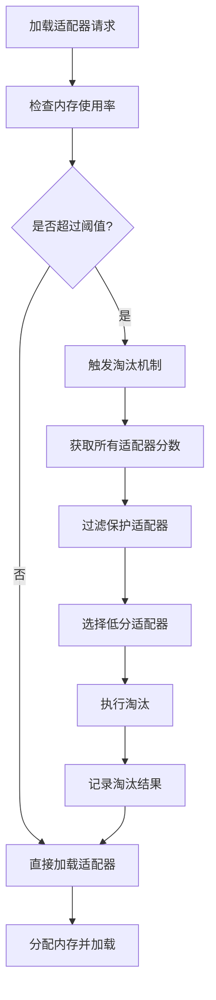
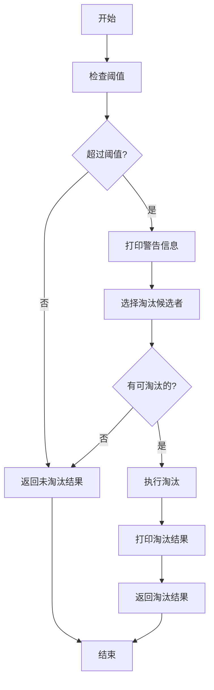

# LoRA 阈值淘汰机制实现计划

## 概述

本文档详细规划了 S-LoRA 系统中基于阈值的 LoRA 适配器淘汰机制的实现步骤。该机制在 LoRA 内存使用率超过阈值时，自动淘汰低分适配器以释放空间。

## 前置条件

- ✅ **步骤 1 已完成**: `get_lora_memory_usage()` 方法已实现，提供内存使用情况监控
- ✅ **评分系统已实现**: `calculate_adapter_score()` 和 `get_adapters_by_score()` 方法可用
- ✅ **淘汰基础设施已存在**: `offload_adapters()` 方法可用于执行实际淘汰

## 总体架构



## 实现步骤细分

### 步骤 2.1: 实现淘汰候选者筛选方法

**文件**: `slora/server/router/model_infer/infer_adapter.py`  
**位置**: 在 `get_lora_memory_usage()` 方法之后

**实现内容**:

```python
def select_eviction_candidates(self, 
                                evict_ratio: float = 0.2,
                                preserve_adapters: set = None) -> List[str]:
    """
    选择要淘汰的适配器候选者
    
    参数:
        evict_ratio: 淘汰的比例（0-1），默认 0.2 (20%)
        preserve_adapters: 必须保留的适配器集合（当前批次使用的）
    
    返回:
        要淘汰的适配器目录列表
    """
```

**实现逻辑**:

1. 获取所有适配器的分数（升序排列，低分在前）
2. 过滤掉保护列表中的适配器
3. 计算要淘汰的数量 = `len(可淘汰适配器) * evict_ratio`
4. 确保至少淘汰 1 个（如果有可淘汰的）
5. 返回低分适配器的目录列表

**边界情况**:
- 没有可淘汰的适配器 → 返回空列表
- 所有适配器都在保护列表中 → 返回空列表
- evict_ratio = 0 → 返回空列表
- evict_ratio = 1 → 返回所有可淘汰适配器

**验证方法**:
- 单元测试：不同 evict_ratio 的结果
- 验证返回的适配器不在保护列表中
- 验证返回的适配器按分数升序

---

### 步骤 2.2: 实现阈值检查方法

**文件**: `slora/server/router/model_infer/infer_adapter.py`  
**位置**: 在 `select_eviction_candidates()` 方法之后

**实现内容**:

```python
def check_memory_threshold(self, threshold: float = 0.9) -> dict:
    """
    检查内存使用率是否超过阈值
    
    参数:
        threshold: 触发淘汰的阈值（0-1），默认 0.9 (90%)
    
    返回:
        {
            'over_threshold': 是否超过阈值 (bool),
            'current_ratio': 当前使用率 (float),
            'threshold': 设置的阈值 (float),
            'usage_info': 内存使用详情 (dict)
        }
    """
```

**实现逻辑**:

1. 调用 `get_lora_memory_usage()` 获取当前使用情况
2. 比较 `usage_ratio` 与 `threshold`
3. 构建并返回检查结果字典

**特殊处理**:
- 如果 `lora_cells == 0`（共享内存模式），考虑使用不同的阈值计算方式
- threshold 参数验证：必须在 [0, 1] 范围内

**验证方法**:
- 模拟不同的内存使用情况
- 验证边界值（0%, 89.9%, 90%, 90.1%, 100%）

---

### 步骤 2.3: 实现淘汰执行和结果记录方法

**文件**: `slora/server/router/model_infer/infer_adapter.py`  
**位置**: 在 `check_memory_threshold()` 方法之后

**实现内容**:

```python
def execute_eviction(self, 
                     adapters_to_evict: List[str]) -> dict:
    """
    执行适配器淘汰并记录结果
    
    参数:
        adapters_to_evict: 要淘汰的适配器目录列表
    
    返回:
        {
            'before_usage': 淘汰前的内存使用情况,
            'after_usage': 淘汰后的内存使用情况,
            'evicted_adapters': 实际淘汰的适配器列表,
            'evicted_count': 淘汰的适配器数量,
            'cells_freed': 释放的 cells 数量
        }
    """
```

**实现逻辑**:

1. 记录淘汰前的内存使用情况
2. 构建保留列表（当前所有适配器 - 要淘汰的）
3. 调用 `offload_adapters(reserve_dirs)` 执行淘汰
4. 记录淘汰后的内存使用情况
5. 计算释放的空间
6. 构建并返回结果字典

**日志输出**:
- 淘汰前使用率
- 淘汰适配器列表（最多显示前 5 个）
- 淘汰后使用率
- 释放的空间大小

**验证方法**:
- 验证淘汰后的 `num_adapters` 减少
- 验证 `cells_freed > 0`
- 验证 `after_usage['usage_ratio'] < before_usage['usage_ratio']`

---

### 步骤 2.4: 实现主淘汰协调方法

**文件**: `slora/server/router/model_infer/infer_adapter.py`  
**位置**: 在 `execute_eviction()` 方法之后

**实现内容**:

```python
def check_and_evict_by_threshold(self, 
                                  threshold: float = 0.9,
                                  evict_ratio: float = 0.2,
                                  preserve_adapters: set = None) -> dict:
    """
    检查空间使用率，超过阈值时淘汰低分适配器
    
    这是阈值淘汰的主入口方法，协调各子步骤完成完整的淘汰流程。
    
    参数:
        threshold: 触发淘汰的阈值（0-1），默认 0.9 (90%)
        evict_ratio: 淘汰的比例（0-1），默认 0.2 (20%)
        preserve_adapters: 必须保留的适配器集合（当前批次使用的）
    
    返回:
        {
            'triggered': 是否触发了淘汰检查,
            'evicted': 是否实际执行了淘汰,
            'reason': 未淘汰的原因（如果未淘汰）,
            'before_usage': 检查前的内存使用情况,
            'after_usage': 淘汰后的内存使用情况（如果淘汰了）,
            'evicted_adapters': 被淘汰的适配器列表,
            'evicted_count': 淘汰的适配器数量,
            'cells_freed': 释放的空间大小
        }
    """
```

**实现流程**:



**实现逻辑**:

1. 调用 `check_memory_threshold()` 检查是否超过阈值
2. 如果未超过阈值，返回"未触发"结果
3. 如果超过阈值：
   - 打印警告信息
   - 调用 `select_eviction_candidates()` 选择候选者
   - 如果没有候选者，返回"无可淘汰"结果
   - 调用 `execute_eviction()` 执行淘汰
   - 打印淘汰结果
   - 返回"已淘汰"结果

**未淘汰的原因**:
- `"below_threshold"`: 使用率未达到阈值
- `"no_adapters"`: 没有加载任何适配器
- `"all_preserved"`: 所有适配器都在保护列表中
- `"no_candidates"`: 没有可淘汰的候选者

**验证方法**:
- 集成测试：模拟不同的内存压力场景
- 验证各种边界情况的返回值
- 验证日志输出的正确性

---

### 步骤 2.5: 在 load_adapters 中集成阈值检查

**文件**: `slora/server/router/model_infer/infer_adapter.py`  
**位置**: 修改现有的 `load_adapters()` 方法

**修改位置**: 在计算 `new_adapters` 之后，调用 `mem_manager.alloc()` 之前

**实现内容**:

```python
def load_adapters(self, adapters, prefetch=False, 
                  enable_threshold_eviction=True,
                  threshold=0.9, 
                  evict_ratio=0.2):
    """
    加载 LoRA 适配器到 GPU 内存
    
    参数:
        adapters: 要加载的适配器列表
        prefetch: 是否为预取模式
        enable_threshold_eviction: 是否启用阈值淘汰（默认 True）
        threshold: 淘汰阈值
        evict_ratio: 淘汰比例
    """
    # ... 现有的扫描逻辑 ...
    
    # ===== 新增：加载前阈值检查 =====
    if not prefetch and enable_threshold_eviction and len(new_adapters) > 0:
        # 收集即将加载的适配器作为保护对象
        preserve_dirs = set()
        for adapter in new_adapters:
            if adapter is not None:
                preserve_dirs.add(adapter.lora_dir)
        
        # 也保护当前已在保护列表中的适配器
        for adapter_dir in self.adapter_dirs:
            if adapter_dir in self.prefetch_tag:
                preserve_dirs.add(adapter_dir)
        
        # 执行阈值检查和可能的淘汰
        evict_result = self.check_and_evict_by_threshold(
            threshold=threshold,
            evict_ratio=evict_ratio,
            preserve_adapters=preserve_dirs
        )
        
        if evict_result['evicted']:
            # 淘汰后打印剩余空间（可选）
            pass
    # ===== 新增结束 =====
    
    # 分配内存
    new_loc = self.mem_manager.alloc(tot_size)
    # ... 后续加载逻辑 ...
```

**关键点**:
1. **只在非预取模式下触发**: 预取模式已有容量检查
2. **保护即将加载的适配器**: 避免刚选中要加载就被淘汰
3. **保护预取标记的适配器**: 避免破坏预取策略
4. **可配置开关**: `enable_threshold_eviction` 参数可关闭此功能

**验证方法**:
- 启动服务器，逐步加载适配器直到触发淘汰
- 验证淘汰的适配器不是即将加载的
- 验证淘汰后有足够空间加载新适配器

---

### 步骤 2.6: 添加淘汰统计和日志方法

**文件**: `slora/server/router/model_infer/infer_adapter.py`  
**位置**: 在 `check_and_evict_by_threshold()` 方法之后

**实现内容**:

```python
def log_eviction_summary(self, evict_result: dict):
    """
    打印详细的淘汰统计信息
    
    参数:
        evict_result: check_and_evict_by_threshold 返回的结果字典
    """
    if not evict_result['triggered']:
        return
    
    print(f"\n{'='*80}")
    print(f"LoRA 阈值淘汰统计")
    print(f"{'='*80}")
    
    before = evict_result['before_usage']
    print(f"淘汰前状态:")
    print(f"  - 内存使用: {before['used_cells']}/{before['total_cells']} cells "
          f"({before['usage_ratio']:.1%})")
    print(f"  - 适配器数: {before['num_adapters']}")
    print(f"  - 可用空间: {before['available_cells']} cells")
    
    if evict_result['evicted']:
        after = evict_result['after_usage']
        print(f"\n淘汰操作:")
        print(f"  - 淘汰数量: {evict_result['evicted_count']}")
        print(f"  - 释放空间: {evict_result['cells_freed']} cells")
        
        if evict_result['evicted_adapters']:
            print(f"  - 淘汰列表（前5个）:")
            for adapter_dir in evict_result['evicted_adapters'][:5]:
                adapter_name = adapter_dir.split('/')[-1]
                score = self.adapter_scores.get(adapter_dir, 0.0)
                print(f"      · {adapter_name} (分数: {score:.4f})")
        
        print(f"\n淘汰后状态:")
        print(f"  - 内存使用: {after['used_cells']}/{after['total_cells']} cells "
              f"({after['usage_ratio']:.1%})")
        print(f"  - 适配器数: {after['num_adapters']}")
        print(f"  - 可用空间: {after['available_cells']} cells")
        print(f"  - 使用率变化: {before['usage_ratio']:.1%} → {after['usage_ratio']:.1%}")
    else:
        print(f"\n淘汰结果: 未执行淘汰")
        print(f"  - 原因: {evict_result['reason']}")
    
    print(f"{'='*80}\n")
```

**日志输出示例**:

```
================================================================================
LoRA 阈值淘汰统计
================================================================================
淘汰前状态:
  - 内存使用: 9200/10000 cells (92.0%)
  - 适配器数: 23
  - 可用空间: 800 cells

淘汰操作:
  - 淘汰数量: 5
  - 释放空间: 2000 cells
  - 淘汰列表（前5个）:
      · adapter_007 (分数: 0.0234)
      · adapter_013 (分数: 0.0456)
      · adapter_021 (分数: 0.0567)
      · adapter_009 (分数: 0.0789)
      · adapter_018 (分数: 0.0890)

淘汰后状态:
  - 内存使用: 7200/10000 cells (72.0%)
  - 适配器数: 18
  - 可用空间: 2800 cells
  - 使用率变化: 92.0% → 72.0%
================================================================================
```

---

## 配置参数设计

### 命令行参数

在 `slora/server/api_server.py` 中添加：

```python
parser.add_argument("--lora-eviction-threshold", type=float, default=0.9,
                    help="LoRA memory usage threshold to trigger eviction (0-1)")
parser.add_argument("--lora-eviction-ratio", type=float, default=0.2,
                    help="Ratio of adapters to evict when threshold is exceeded (0-1)")
parser.add_argument("--disable-threshold-eviction", action="store_true",
                    help="Disable threshold-based LoRA eviction")
```

### InputParams 更新

在 `slora/server/input_params.py` 中添加：

```python
class InputParams:
    def __init__(self, ...
                 lora_eviction_threshold=0.9,
                 lora_eviction_ratio=0.2,
                 enable_threshold_eviction=True,
                 ...):
        self.lora_eviction_threshold = lora_eviction_threshold
        self.lora_eviction_ratio = lora_eviction_ratio
        self.enable_threshold_eviction = enable_threshold_eviction
```

---

## 测试计划

### 单元测试

**测试文件**: `test/test_threshold_eviction.py`

1. **测试 select_eviction_candidates**:
   - 空适配器列表
   - 所有适配器都被保护
   - 不同的 evict_ratio (0, 0.2, 0.5, 1.0)
   - 边界情况（只有 1 个可淘汰的）

2. **测试 check_memory_threshold**:
   - 使用率低于阈值
   - 使用率等于阈值
   - 使用率高于阈值
   - 边界值测试

3. **测试 execute_eviction**:
   - 淘汰单个适配器
   - 淘汰多个适配器
   - 验证统计数据正确性

### 集成测试

**测试场景**:

1. **场景 1: 正常加载（低压力）**
   - 加载 10 个适配器
   - 内存使用率 < 90%
   - 验证：不触发淘汰

2. **场景 2: 触发淘汰**
   - 逐步加载适配器直到内存使用率 > 90%
   - 验证：触发淘汰，低分适配器被移除
   - 验证：新适配器成功加载

3. **场景 3: 所有适配器都在使用中**
   - 创建批次使用所有适配器
   - 尝试加载新适配器
   - 验证：不淘汰任何适配器，可能抛出内存不足异常

4. **场景 4: 连续触发淘汰**
   - 持续加载大量适配器
   - 验证：多次触发淘汰，系统稳定运行

### 压力测试

**测试配置**:
- 适配器数量: 100+
- 并发请求: 50+
- 运行时长: 10 分钟
- 监控指标:
  - 淘汰触发频率
  - 平均淘汰数量
  - 内存使用率趋势
  - 请求处理延迟

---

## 实现顺序

### 阶段 1: 基础方法（必须按顺序）

1. ✅ **步骤 2.1**: `select_eviction_candidates()` - 候选者筛选
2. ✅ **步骤 2.2**: `check_memory_threshold()` - 阈值检查
3. ✅ **步骤 2.3**: `execute_eviction()` - 淘汰执行
4. ✅ **步骤 2.4**: `check_and_evict_by_threshold()` - 主协调方法

### 阶段 2: 集成（依赖阶段 1）

5. ✅ **步骤 2.5**: 修改 `load_adapters()` - 集成到加载流程
6. ✅ **步骤 2.6**: `log_eviction_summary()` - 增强日志

### 阶段 3: 配置和测试（可并行）

7. ⏸️ 添加命令行参数
8. ⏸️ 更新 InputParams
9. ⏸️ 编写单元测试
10. ⏸️ 执行集成测试

---

## 关键设计决策

| 决策点 | 选项 | 选择 | 理由 |
|--------|------|------|------|
| 触发时机 | 加载前 vs 定期检查 | 加载前 | 简单有效，避免后台线程复杂性 |
| 淘汰比例 | 固定 vs 动态 | 固定（可配置） | 行为可预测，易于调试 |
| 保护策略 | 仅当前批次 vs 多维度 | 仅当前批次 + 预取标记 | 安全优先，避免破坏正在使用的 |
| 候选者排序 | 单一分数 vs 多策略 | 使用已有的综合分数 | 利用现有评分系统 |
| 日志详细度 | 简单 vs 详细 | 详细 | 便于调试和监控 |
| 配置方式 | 硬编码 vs 命令行 | 命令行参数 | 灵活性高 |

---

## 潜在问题和解决方案

### 问题 1: 频繁触发淘汰导致性能下降

**症状**: 每次加载都触发淘汰，增加延迟  
**解决方案**:
- 降低淘汰目标使用率（淘汰到 70% 而不是 80%）
- 增加淘汰比例，一次性释放更多空间
- 添加淘汰冷却时间

### 问题 2: 淘汰过于激进，频繁重新加载

**症状**: 刚淘汰的适配器又被加载回来  
**解决方案**:
- 调整评分权重，增加 recency 的权重
- 添加"最近淘汰"保护期
- 降低 evict_ratio

### 问题 3: 内存碎片导致分配失败

**症状**: 使用率不高但无法分配连续空间  
**解决方案**:
- 优先淘汰占用大空间的低分适配器
- 考虑实现内存整理机制
- 使用非连续分配策略

### 问题 4: 所有适配器都被保护，无法淘汰

**症状**: 批次使用所有适配器，新请求无法加载  
**解决方案**:
- 降低 `--num-adapter` 或增加 `--pool-size-lora`
- 实现请求队列，等待空间释放
- 考虑强制淘汰策略（高风险）

### 问题 5: 批次运行期间 Adapter 被错误淘汰 ⚠️

**症状**: `ValueError: 'xxx' is not in list` 错误，发生在 `lora_unordered_batch_infer.py`  
**原因**: Manager 端和 RPC 端的 batch 对象不同步，导致淘汰了 RPC 端还在使用的 adapters  
**解决方案**: ✅ 已修复
- 在 `_handle_finish_req` 中，在 `filter_finished()` 之前保存 `original_adapter_dirs`
- 触发淘汰时使用 `original_adapter_dirs` 作为保护列表
- 确保 RPC 端的 batch 对象在同步之前不会失去对 adapters 的引用

---

## 性能考虑

### 时间复杂度

- `select_eviction_candidates()`: O(N log N) - 排序所有适配器
- `check_memory_threshold()`: O(1) - 简单查询
- `execute_eviction()`: O(M) - M 为淘汰数量
- **总体**: O(N log N)，N 为适配器总数

### 优化建议

1. **缓存分数**: 避免每次都重新计算所有分数
2. **增量更新**: 维护有序列表，只在必要时重排
3. **批量淘汰**: 一次性淘汰多个，避免频繁操作
4. **异步执行**: 考虑将淘汰操作异步化（高级）

---

## 监控指标

建议添加以下监控指标：

1. **淘汰统计**:
   - 总淘汰次数
   - 总淘汰适配器数量
   - 平均每次淘汰数量
   - 总释放空间

2. **性能指标**:
   - 淘汰操作耗时
   - 加载适配器平均耗时
   - 内存分配失败次数

3. **内存指标**:
   - 当前内存使用率
   - 峰值内存使用率
   - 平均内存使用率

---

## 未来扩展

1. **多级阈值**: 不同阈值触发不同强度的淘汰
2. **预测式淘汰**: 根据请求模式预测并提前淘汰
3. **分组淘汰**: 按适配器类型或任务分组管理
4. **自适应阈值**: 根据负载动态调整阈值
5. **内存预留**: 为高优先级适配器预留空间

---

## 文档更新

实现完成后需要更新：

1. **README_CN.md**: 添加阈值淘汰参数说明
2. **SCORING_INTEGRATION.md**: 添加淘汰机制说明
3. **API 文档**: 更新相关 RPC 方法文档

---

## 问题修复 1：批次运行期间 Adapter 被错误淘汰

### 问题描述

在实现阈值淘汰机制后，出现以下错误：
```
ValueError: '/home/hzheng/models/alpaca-lora-7b-18' is not in list
```
错误发生在 `lora_unordered_batch_infer.py:37`：
```python
idx = infer_adapter.adapter_dirs.index(adapter.lora_dir)
```

### 问题根因

**Manager 端和 RPC 端的 batch 对象不同步**，导致在批次运行期间淘汰了批次正在使用的 adapters。

#### 时间线：

1. **Manager 端**（`manager.py`）：
   - `_decode_batch()` 完成后调用 `_handle_finish_req()`
   - 在 `_handle_finish_req` 中调用 `batch.filter_finished()`
   - `filter_finished()` 更新 `batch.adapter_dirs`，移除已完成请求使用的 adapters
   - 然后触发淘汰：`preserve_dirs=batch.adapter_dirs`（已更新后的）
   - 淘汰机制卸载那些不在更新后 `batch.adapter_dirs` 中的 adapters

2. **RPC 端**（`model_rpc.py`）：
   - RPC 端维护自己的 batch 副本，存储在 `self.cache[batch_id]` 中
   - 这个副本的 `batch.adapter_dirs` **没有被同步更新**
   - 下一次 decode 时，RPC 端尝试使用旧的 `batch.adapter_dirs` 中的 adapters
   - 但这些 adapters 已经在 Manager 端被淘汰了
   - 在创建 `LoraUnorderedBatchInfer` 时，查找 adapter 索引失败

### 为什么会出现这个问题？

**旧逻辑**（没有阈值淘汰时）：
- 只在批次完全清空时才卸载 adapters
- 不会在批次运行过程中卸载 adapters

**新逻辑**（有阈值淘汰）：
- 在 `_handle_finish_req` 中，当部分请求完成时就可能触发淘汰
- Manager 端更新了 `batch.adapter_dirs`
- 但 RPC 端的 `batch.adapter_dirs` 没有同步
- 导致 RPC 端尝试使用已被淘汰的 adapters

### 解决方案

**在批次运行期间，必须保护批次的原始 `adapter_dirs`（filter_finished 之前的），而不是过滤后的**。

#### 代码修改（`manager.py`）

在 `_handle_finish_req()` 方法中：

```python
# 保存批次的原始 adapter_dirs（在 filter_finished 之前）
# 这些是批次当前正在使用的所有 adapters，包括已完成请求的
# 必须保护它们，因为 RPC 端的 batch 对象还持有对它们的引用
original_adapter_dirs = batch.adapter_dirs.copy() if not self.input_params.no_lora else None

# 过滤掉已完成的请求，只保留未完成的请求
# 同时会更新 batch.adapter_dirs，只包含未完成请求使用的适配器
batch.filter_finished()

# ... 后续代码 ...

# 触发淘汰时，使用原始的 adapter_dirs
ret.append(self.model_rpcs[tp_rank].trigger_threshold_eviction(
    preserve_dirs=original_adapter_dirs,  # 使用原始的，而不是 batch.adapter_dirs
    threshold=self.input_params.evict_interval_threshold,
    evict_ratio=self.input_params.evict_interval_ratio,
    max_lora_ratio=self.input_params.max_lora_ratio
))
```

### 关键点

1. **保护时机**：在 `filter_finished()` 之前保存 `adapter_dirs`
2. **保护范围**：包括已完成请求使用的 adapters，因为 RPC 端还在使用它们
3. **同步机制**：RPC 端的 batch 状态通过 `filter_batch` RPC 调用同步，在此之前必须保护所有 adapters

### 验证

修复后，即使批次中部分请求完成，这些请求使用的 adapters 也不会被淘汰，直到：
1. 批次完全清空（`_filter_runing_batch`），或
2. RPC 端通过 `filter_batch` 同步了状态

### 问题延伸：加载时也需要保护

修复上述问题后，发现还有一个问题：**在 `load_adapters` 中触发淘汰时，也会淘汰当前批次正在使用的 adapters**。

#### 补充修复（`model_rpc.py` 和 `infer_adapter.py`）

1. **`exposed_load_adapters()` 方法**：
```python
# 收集当前所有活跃批次使用的 adapters，作为保护列表
active_adapters = set()
for batch in self.cache.values():
    if hasattr(batch, 'adapter_dirs'):
        active_adapters.update(batch.adapter_dirs)

self.infer_adapter.load_adapters(
    adapters, 
    prefetch=prefetch,
    active_batch_adapters=active_adapters if not prefetch else None
)
```

2. **`load_adapters()` 方法**：
- 新增 `active_batch_adapters` 参数
- 在保护列表中加入活跃批次的 adapters：
```python
if active_batch_adapters:
    preserve_dirs.update(active_batch_adapters)
```

这样可以确保在加载新 adapters 触发淘汰时，不会淘汰任何正在使用的 adapters。

---

## 问题修复 2：KV Cache 空间不足

### 问题描述

在实现阈值淘汰机制后，发现存在一个问题：**LoRA 适配器占用了 90%+ 的内存，导致 KV cache 无法分配足够的连续空间**，出现错误：
```
Exception: warn no enough pool space: need_size 22 left_size 10
```

### 解决方案

实现 **固定 LoRA 空间上限机制**：通过 `max_lora_ratio` 参数限制 LoRA 占用总内存的最大比例，剩余空间保证给 KV cache 使用。

### 代码修改总结

#### 1. 核心逻辑修改 (`infer_adapter.py`)

**`select_eviction_candidates()` 方法**：
- 新增 `max_lora_ratio` 参数（0-1）
- 当设置该参数时，计算当前 LoRA 占用和上限差值
- 累积淘汰低分适配器，直到释放足够空间，确保 LoRA 不超过上限

**`check_and_evict_by_threshold()` 方法**：
- 新增 `max_lora_ratio` 参数传递
- 添加日志输出：显示当前 LoRA 占用、上限设置、需释放空间

**`load_adapters()` 方法**：
- 新增 `max_lora_ratio` 参数
- 在加载前阈值检查时传递该参数

#### 2. RPC 接口修改 (`model_rpc.py`)

- `exposed_trigger_threshold_eviction()`: 新增 `max_lora_ratio` 参数
- `trigger_threshold_eviction()`: 新增 `max_lora_ratio` 参数

#### 3. 配置参数添加

**`input_params.py`**:
- `InputParams.__init__()`: 新增 `max_lora_ratio` 参数
- 存储为实例变量 `self.max_lora_ratio`

**`api_server.py`**:
- 新增命令行参数 `--max-lora-ratio`，默认值 `0.7` (70%)

**`manager.py`**:
- `InputParams` 实例化时传递 `max_lora_ratio=args.max_lora_ratio`
- `trigger_threshold_eviction()` 调用时传递 `max_lora_ratio=self.input_params.max_lora_ratio`

**`launch_server.py`**:
- 新增命令行参数 `--max-lora-ratio`
- 传递给 `api_server.py` 命令

### 使用方式

```bash
# 设置 LoRA 最多占用 60% 内存，剩余 40% 保证给 KV cache
python launch_server.py \
  --num-adapter 100 \
  --num-token 10000 \
  --model-setting Real \
  --max-lora-ratio 0.6
```

### 工作原理

1. **触发条件**：内存使用率超过阈值时
2. **空间计算**：
   - `当前 LoRA 占用 = sum(所有适配器的 cells)`
   - `LoRA 上限 = total_cells × max_lora_ratio`
   - `需释放空间 = max(0, 当前 LoRA 占用 - LoRA 上限)`
3. **淘汰策略**：按分数从低到高累积淘汰，直到释放足够空间
4. **空间保证**：确保 KV cache 至少有 `(1 - max_lora_ratio) × total_cells` 的可用空间

### 效果

- ✅ **解决 KV cache 分配失败**：保证 KV cache 有足够的连续空间
- ✅ **可配置的平衡**：根据场景调整 LoRA 和 KV cache 的空间分配
- ✅ **智能淘汰**：基于分数优先淘汰低价值适配器
- ✅ **详细日志**：显示 LoRA 占用、上限、需释放空间等信息

---

## 总结

本计划将阈值淘汰机制分解为 6 个清晰的步骤，每个步骤都有明确的输入、输出和验证方法。按照此计划实施，可以构建一个健壮、可配置、易于调试的淘汰系统。

**预计工作量**: 
- 核心实现: 4-6 小时
- 测试验证: 2-3 小时
- 文档更新: 1 小时
- **总计**: 7-10 小时

**额外修复**:
- 问题修复 1: 批次运行期间 Adapter 被错误淘汰 - 已完成 ✅
  - Manager 端和 RPC 端 batch 对象不同步问题
  - 保护批次原始 adapter_dirs，避免淘汰正在使用的 adapters
- 问题修复 2: KV cache 空间不足问题 - 已完成 ✅
  - 固定 LoRA 空间上限机制实现
  - 通过 `max_lora_ratio` 参数保证 KV cache 有足够空间
- 问题修复 3: 并发控制与阈值淘汰的冲突 - 已完成 ✅
  - 并发控制现在感知实际 adapter 占用
  - RouterManager 通过 RPC 查询并缓存实际占用
  - ReqQueue 使用实际占用进行准确的空间判断
  - 添加详细的调试日志用于排查并发问题

---

## 问题修复 3：并发控制感知实际 Adapter 占用

### 问题描述

在引入阈值淘汰机制后，"热门" LoRA adapters 会长期保留在显存中。但是，S-LoRA 的并发控制（`ReqQueue._can_add_new_req()`）只计算**当前批次**的 adapter 占用，无法感知显存中**实际保留**的所有 adapters。

这导致：
1. 预估可用空间远大于实际空间
2. 并发控制允许过多请求进入
3. 触发 KV cache OOM：`Exception: warn no enough pool space`

### 解决方案

**方案 B：RouterManager 维护实际占用并传递**

#### 架构设计

```
RouterManager
  ├─ actual_adapter_memory_usage (缓存字段)
  ├─ _update_actual_adapter_usage() (查询并更新)
  │    └─ RPC 调用 → check_lora_memory()
  │    └─ 计算总和 → actual_adapter_memory_usage
  └─ 在关键时刻更新：
       ├─ 初始化后
       ├─ 加载 adapters 后
       └─ 淘汰 adapters 后

ReqQueue
  ├─ actual_total_adapter_size (从参数接收)
  ├─ _init_cache_list(actual_adapter_size=0)
  ├─ _can_add_new_req()
  │    └─ total = actual_total_adapter_size + adapter_size
  │    └─ 使用 total 进行空间判断
  └─ generate_new_batch(actual_adapter_size=0)
```

#### 实现细节

1. **RouterManager 维护缓存**：
   - 添加 `self.actual_adapter_memory_usage` 字段
   - 实现 `_update_actual_adapter_usage()` 方法
   - 在初始化、加载、淘汰后调用更新

2. **ReqQueue 接收实际占用**：
   - `_init_cache_list()` 接收 `actual_adapter_size` 参数
   - `_can_add_new_req()` 使用 `actual_total_adapter_size + adapter_size`
   - `generate_new_batch()` 传递 `actual_adapter_size`

3. **所有 Queue 子类同步修改**：
   - `vtc_req_queue.py`
   - `peft_req_queue.py`
   - `pets_req_queue.py`
   - `cluster_req_queue.py`
   - `abort_req_queue.py`

4. **调试日志**：
   - 在 `_can_add_new_req()` 返回 False 时打印详细信息
   - 显示需要空间、实际占用、可用空间等

### 效果

- ✅ **准确判断**：使用实际占用而非预估占用
- ✅ **防止 OOM**：并发控制能够准确拒绝会导致 OOM 的请求
- ✅ **性能好**：缓存机制，不需要频繁 RPC 查询
- ✅ **向后兼容**：查询失败时使用上次缓存值
- ✅ **易于调试**：详细的日志输出帮助定位问题

### 权衡

**优点**：
- 准确：使用实际占用
- 高效：缓存机制，低开销
- 健壮：容错处理

**限制**：
- 短暂延迟：更新不是实时的（几毫秒）
- 依赖 RPC：需要 RPC 查询功能正常

